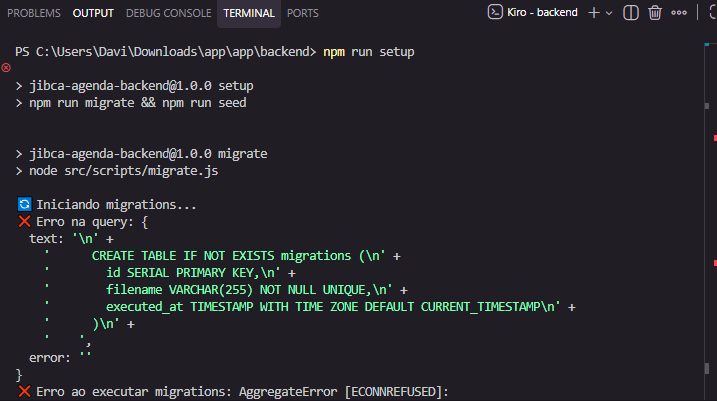
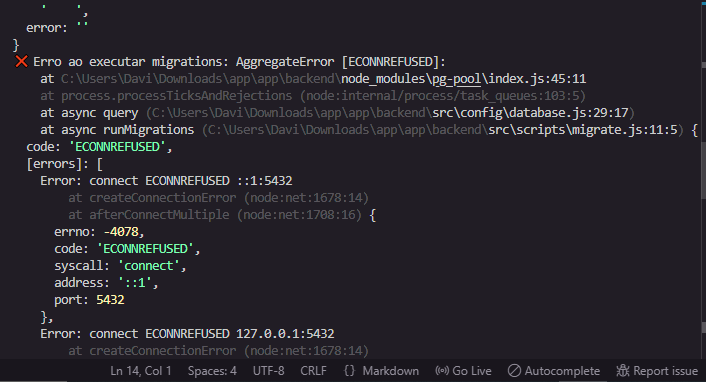
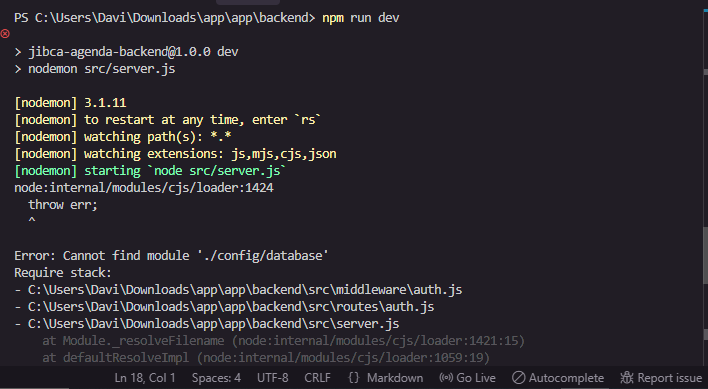
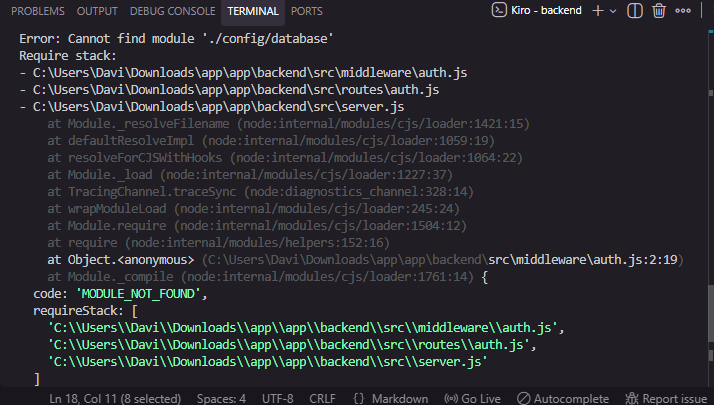
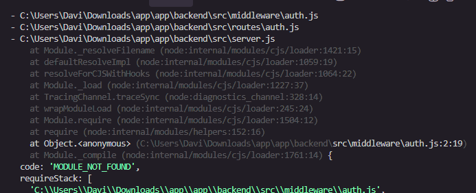
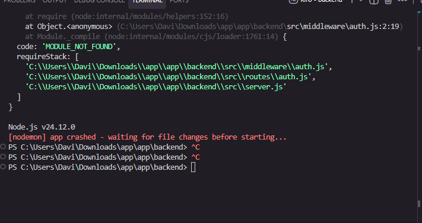

*FEEDBACK - TESTES - BACKEND*
🚀 Como Testar
cd app/backend
npm install
npm run setup  # Cria banco e popula dados
npm run dev    # Inicia servidor na porta 3000

Ao executar os comandos *npm run setup  # Cria banco e popula dados* e 
*npm run dev    # Inicia servidor na porta 3000*, apareceram algumas mensagens de erro no terminal, e não alcancei o resultado esperado dos testes.

Erro 1:

Erro 2:

