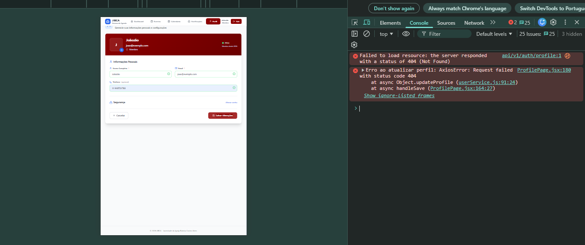

# Modernização Backend - Agenda JIBCA
## Documento Técnico de Correções e Implementações

**Data**: 05 de Fevereiro de 2026  
**Versão**: 2.0.0  
**Foco**: Backend (Node.js + Express + PostgreSQL)  
**Status**: Planejamento

---

## 🎯 Objetivo

Corrigir falhas críticas no backend e implementar funcionalidades essenciais para garantir o funcionamento correto e preciso de todas as operações do sistema Agenda JIBCA, com foco em robustez, consistência de dados e comportamento não-ambíguo.

---

## 🔴 Problemas Críticos Identificados

### 1. **Autenticação e Recuperação de Senha**

#### **Problema Atual**
- Sistema não possui funcionalidade de recuperação de senha
- Membros cadastrados pelo líder não conseguem redefinir credenciais de forma independente
- Falta fluxo de "Esqueci minha senha"

#### **Solução Proposta**
Implementar sistema completo de recuperação de senha com os seguintes componentes:

**Backend - Novos Endpoints:**

```
POST /api/v1/auth/forgot-password
Body: { "email": "usuario@exemplo.com" }
Retorno: { "message": "Token de recuperação gerado", "token": "abc123..." }
```

```
POST /api/v1/auth/reset-password
Body: { 
  "token": "abc123...",
  "newPassword": "novaSenha123",
  "confirmPassword": "novaSenha123"
}
Retorno: { "message": "Senha alterada com sucesso" }
```

**Banco de Dados - Nova Tabela:**

```sql
CREATE TABLE password_reset_tokens (
  id UUID PRIMARY KEY DEFAULT gen_random_uuid(),
  user_id UUID NOT NULL REFERENCES users(id) ON DELETE CASCADE,
  token VARCHAR(255) UNIQUE NOT NULL,
  expires_at TIMESTAMP NOT NULL,
  used BOOLEAN DEFAULT false,
  created_at TIMESTAMP DEFAULT CURRENT_TIMESTAMP
);

CREATE INDEX idx_password_reset_token ON password_reset_tokens(token);
CREATE INDEX idx_password_reset_user_id ON password_reset_tokens(user_id);
CREATE INDEX idx_password_reset_expires ON password_reset_tokens(expires_at);
```

**Regras de Negócio:**
- Token deve expirar em 1 hora (configurável via .env)
- Token de uso único (após usado, marcar como `used = true`)
- Validar se token não expirou antes de permitir reset
- Hash da nova senha com bcrypt (salt rounds: 10)
- Limpar tokens expirados automaticamente (cron job diário)
- Usuário deve estar ativo (`is_active = true`) para solicitar reset

**Validações:**
- Email deve existir no banco de dados
- Email deve pertencer a usuário ativo
- Senha nova deve ter mínimo 8 caracteres
- confirmPassword deve ser idêntico a newPassword
- Token deve ser válido, não expirado e não usado

---

### 2. **Eventos - Listagem Vazia**

#### **Problema Atual**
- Quando não há eventos cadastrados, a aplicação "trava" ou retorna erro
- Frontend não consegue renderizar estado vazio corretamente
- Possível causa: backend retornando `null` ou erro 500 ao invés de array vazio

#### **Solução Proposta**

**Endpoint Afetado:**
```
GET /api/v1/events
```

**Correção no Controller:**

```javascript
// eventos.controller.js - Método getEvents

async getEvents(req, res) {
  try {
    const { type, month, year } = req.query;
    
    const events = await eventService.getEvents({
      type,
      month: month ? parseInt(month) : undefined,
      year: year ? parseInt(year) : undefined
    });
    
    // CRÍTICO: Sempre retornar array, mesmo vazio
    return res.status(200).json({
      success: true,
      data: events || [],  // Garantir array vazio se null/undefined
      total: events ? events.length : 0,
      filters: { type, month, year }
    });
    
  } catch (error) {
    console.error('Erro ao buscar eventos:', error);
    return res.status(500).json({
      success: false,
      message: 'Erro ao buscar eventos',
      data: []  // Mesmo em erro, retornar estrutura consistente
    });
  }
}
```

**Correção no Repository:**

```javascript
// eventos.repository.js

async findAll(filters = {}) {
  try {
    let query = `
      SELECT 
        e.id,
        e.title,
        e.description,
        e.event_date,
        e.event_time,
        e.location,
        e.created_at,
        et.id as type_id,
        et.name as type_name,
        et.color as type_color,
        u.name as created_by_name,
        COUNT(DISTINCT c.id) FILTER (WHERE c.status = 'confirmed') as confirmed_count
      FROM events e
      INNER JOIN event_types et ON e.event_type_id = et.id
      INNER JOIN users u ON e.created_by = u.id
      LEFT JOIN confirmations c ON e.id = c.event_id
      WHERE 1=1
    `;
    
    const params = [];
    let paramIndex = 1;
    
    // Aplicar filtros opcionais
    if (filters.type) {
      query += ` AND et.id = $${paramIndex}`;
      params.push(filters.type);
      paramIndex++;
    }
    
    if (filters.month && filters.year) {
      query += ` AND EXTRACT(MONTH FROM e.event_date) = $${paramIndex}`;
      params.push(filters.month);
      paramIndex++;
      query += ` AND EXTRACT(YEAR FROM e.event_date) = $${paramIndex}`;
      params.push(filters.year);
      paramIndex++;
    }
    
    query += `
      GROUP BY e.id, et.id, et.name, et.color, u.name
      ORDER BY e.event_date ASC, e.event_time ASC
    `;
    
    const result = await db.query(query, params);
    
    // CRÍTICO: Sempre retornar array
    return result.rows || [];
    
  } catch (error) {
    console.error('Erro no repository ao buscar eventos:', error);
    // Em caso de erro, retornar array vazio ao invés de throw
    return [];
  }
}
```

**Validações Adicionais:**
- Verificar se `result.rows` existe antes de retornar
- Garantir que tipos de eventos existam no banco (seed obrigatório)
- Adicionar índices para otimizar queries de listagem

---

### 3. **Eventos - Criação com Tipo de Evento**

#### **Problema Atual**
- Campo "Tipo de evento" não está sendo aceito ao criar novo evento
- Possível causa: validação incorreta do `event_type_id` ou FK constraint

#### **Solução Proposta**

**Endpoint Afetado:**
```
POST /api/v1/events
Body: {
  "title": "Culto de Jovens",
  "description": "Culto especial",
  "event_type_id": 1,
  "event_date": "2026-02-15",
  "event_time": "19:00",
  "location": "Igreja JIBCA"
}
```

**Correção no Controller:**

```javascript
// eventos.controller.js - Método createEvent

async createEvent(req, res) {
  try {
    const { title, description, event_type_id, event_date, event_time, location } = req.body;
    const createdBy = req.user.id; // ID do líder logado
    
    // Validação: Verificar se event_type_id é válido
    if (!event_type_id || isNaN(parseInt(event_type_id))) {
      return res.status(400).json({
        success: false,
        message: 'Tipo de evento inválido'
      });
    }
    
    // Validação: Verificar se tipo existe no banco
    const typeExists = await eventTypeService.exists(event_type_id);
    if (!typeExists) {
      return res.status(400).json({
        success: false,
        message: 'Tipo de evento não encontrado'
      });
    }
    
    // Validação: Data deve ser futura
    const eventDateTime = new Date(`${event_date}T${event_time}`);
    if (eventDateTime < new Date()) {
      return res.status(400).json({
        success: false,
        message: 'Data e hora do evento devem ser futuras'
      });
    }
    
    const newEvent = await eventService.createEvent({
      title,
      description,
      event_type_id: parseInt(event_type_id), // CRÍTICO: Converter para integer
      event_date,
      event_time,
      location,
      created_by: createdBy
    });
    
    // Criar notificações para todos os membros
    await notificationService.notifyEventCreated(newEvent.id);
    
    return res.status(201).json({
      success: true,
      message: 'Evento criado com sucesso',
      data: newEvent
    });
    
  } catch (error) {
    console.error('Erro ao criar evento:', error);
    return res.status(500).json({
      success: false,
      message: 'Erro ao criar evento',
      error: process.env.NODE_ENV === 'development' ? error.message : undefined
    });
  }
}
```

**Correção no Middleware de Validação:**

```javascript
// middleware/validators/event.validator.js

const { body, validationResult } = require('express-validator');

const createEventValidation = [
  body('title')
    .trim()
    .notEmpty().withMessage('Título é obrigatório')
    .isLength({ min: 3, max: 200 }).withMessage('Título deve ter entre 3 e 200 caracteres'),
  
  body('description')
    .trim()
    .notEmpty().withMessage('Descrição é obrigatória')
    .isLength({ min: 10 }).withMessage('Descrição deve ter no mínimo 10 caracteres'),
  
  body('event_type_id')
    .notEmpty().withMessage('Tipo de evento é obrigatório')
    .isInt({ min: 1 }).withMessage('Tipo de evento deve ser um número válido')
    .toInt(), // CRÍTICO: Converter para inteiro
  
  body('event_date')
    .notEmpty().withMessage('Data é obrigatória')
    .isDate({ format: 'YYYY-MM-DD' }).withMessage('Data inválida (formato: YYYY-MM-DD)')
    .custom((value) => {
      const inputDate = new Date(value);
      const today = new Date();
      today.setHours(0, 0, 0, 0);
      if (inputDate < today) {
        throw new Error('Data deve ser futura');
      }
      return true;
    }),
  
  body('event_time')
    .notEmpty().withMessage('Horário é obrigatório')
    .matches(/^([01]\d|2[0-3]):([0-5]\d)$/).withMessage('Horário inválido (formato: HH:MM)'),
  
  body('location')
    .trim()
    .notEmpty().withMessage('Local é obrigatório')
    .isLength({ min: 3, max: 255 }).withMessage('Local deve ter entre 3 e 255 caracteres'),
  
  // Middleware para capturar erros
  (req, res, next) => {
    const errors = validationResult(req);
    if (!errors.isEmpty()) {
      return res.status(400).json({
        success: false,
        message: 'Dados inválidos',
        errors: errors.array().map(err => ({
          field: err.param,
          message: err.msg
        }))
      });
    }
    next();
  }
];

module.exports = { createEventValidation };
```

**Correção no Repository:**

```javascript
// eventos.repository.js - Método create

async create(eventData) {
  const client = await db.getClient();
  
  try {
    await client.query('BEGIN');
    
    const query = `
      INSERT INTO events (
        title,
        description,
        event_type_id,
        event_date,
        event_time,
        location,
        created_by
      ) VALUES ($1, $2, $3, $4, $5, $6, $7)
      RETURNING 
        id,
        title,
        description,
        event_type_id,
        event_date,
        event_time,
        location,
        created_by,
        created_at
    `;
    
    const values = [
      eventData.title,
      eventData.description,
      eventData.event_type_id, // Já vem como integer do controller
      eventData.event_date,
      eventData.event_time,
      eventData.location,
      eventData.created_by
    ];
    
    const result = await client.query(query, values);
    
    await client.query('COMMIT');
    
    return result.rows[0];
    
  } catch (error) {
    await client.query('ROLLBACK');
    console.error('Erro ao criar evento no banco:', error);
    throw error;
  } finally {
    client.release();
  }
}
```

**Garantir Tipos de Eventos no Banco (Seed):**

```sql
-- migrations/002_seed_event_types.sql

INSERT INTO event_types (id, name, description, color) VALUES
  (1, 'Culto', 'Culto da juventude', '#3b82f6'),
  (2, 'Reunião', 'Reunião de planejamento', '#8b5cf6'),
  (3, 'Estudo Bíblico', 'Estudo da palavra', '#f59e0b'),
  (4, 'Passeio', 'Atividade recreativa', '#10b981'),
  (5, 'Retiro', 'Retiro espiritual', '#ec4899'),
  (6, 'Conferência', 'Conferência ou congresso', '#06b6d4'),
  (7, 'Outro', 'Outros tipos de eventos', '#6b7280')
ON CONFLICT (id) DO NOTHING;
```

---

### 4. **Membros - Reativação**

#### **Problema Atual**
- Botão "Reativar membro" não funciona
- Endpoint de reativação pode estar faltando ou com lógica incorreta

#### **Solução Proposta**

**Novo Endpoint:**
```
PATCH /api/v1/users/:id/reactivate
```

**Implementação no Controller:**

```javascript
// users.controller.js - Método reactivateUser

async reactivateUser(req, res) {
  try {
    const { id } = req.params;
    
    // Validar UUID
    if (!isValidUUID(id)) {
      return res.status(400).json({
        success: false,
        message: 'ID de usuário inválido'
      });
    }
    
    // Buscar usuário
    const user = await userService.findById(id);
    
    if (!user) {
      return res.status(404).json({
        success: false,
        message: 'Usuário não encontrado'
      });
    }
    
    // Verificar se já está ativo
    if (user.is_active) {
      return res.status(400).json({
        success: false,
        message: 'Usuário já está ativo'
      });
    }
    
    // Reativar usuário
    const reactivatedUser = await userService.reactivate(id);
    
    return res.status(200).json({
      success: true,
      message: 'Usuário reativado com sucesso',
      data: reactivatedUser
    });
    
  } catch (error) {
    console.error('Erro ao reativar usuário:', error);
    return res.status(500).json({
      success: false,
      message: 'Erro ao reativar usuário'
    });
  }
}
```

**Implementação no Service:**

```javascript
// users.service.js - Método reactivate

async reactivate(userId) {
  try {
    const user = await userRepository.reactivate(userId);
    
    if (!user) {
      throw new Error('Usuário não encontrado');
    }
    
    // Log da operação
    console.log(`Usuário reativado: ${user.email} (ID: ${userId})`);
    
    return {
      id: user.id,
      name: user.name,
      email: user.email,
      phone: user.phone,
      birth_date: user.birth_date,
      role: user.role,
      is_active: user.is_active,
      updated_at: user.updated_at
    };
    
  } catch (error) {
    console.error('Erro no service ao reativar usuário:', error);
    throw error;
  }
}
```

**Implementação no Repository:**

```javascript
// users.repository.js - Método reactivate

async reactivate(userId) {
  try {
    const query = `
      UPDATE users
      SET 
        is_active = true,
        updated_at = CURRENT_TIMESTAMP
      WHERE id = $1
      RETURNING 
        id,
        name,
        email,
        phone,
        birth_date,
        role,
        is_active,
        created_at,
        updated_at
    `;
    
    const result = await db.query(query, [userId]);
    
    return result.rows[0] || null;
    
  } catch (error) {
    console.error('Erro no repository ao reativar usuário:', error);
    throw error;
  }
}
```

**Adicionar Rota:**

```javascript
// routes/users.routes.js

const express = require('express');
const router = express.Router();
const usersController = require('../controllers/users.controller');
const { authenticateToken, requireLeader } = require('../middleware/auth.middleware');

// ... outras rotas ...

// Reativar usuário (apenas líder)
router.patch('/:id/reactivate', authenticateToken, requireLeader, usersController.reactivateUser);

module.exports = router;
```

---

### 5. **Membros - Edição**

#### **Problema Atual**
- Endpoint `PUT /api/v1/users/:id` não funciona corretamente
- Possível causa: validações incorretas ou falta de tratamento de campos

#### **Solução Proposta**

**Endpoint Afetado:**
```
PUT /api/v1/users/:id
Body: {
  "name": "João Silva",
  "email": "joao.silva@exemplo.com",
  "phone": "(19) 99999-9999",
  "birth_date": "1995-05-15",
  "role": "member"
}
```

**Correção no Controller:**

```javascript
// users.controller.js - Método updateUser

async updateUser(req, res) {
  try {
    const { id } = req.params;
    const { name, email, phone, birth_date, role } = req.body;
    
    // Validar UUID
    if (!isValidUUID(id)) {
      return res.status(400).json({
        success: false,
        message: 'ID de usuário inválido'
      });
    }
    
    // Verificar se usuário existe
    const existingUser = await userService.findById(id);
    if (!existingUser) {
      return res.status(404).json({
        success: false,
        message: 'Usuário não encontrado'
      });
    }
    
    // Verificar se email já está em uso por outro usuário
    if (email && email !== existingUser.email) {
      const emailExists = await userService.findByEmail(email);
      if (emailExists && emailExists.id !== id) {
        return res.status(400).json({
          success: false,
          message: 'Email já está em uso por outro usuário'
        });
      }
    }
    
    // Validar role
    if (role && !['leader', 'member'].includes(role)) {
      return res.status(400).json({
        success: false,
        message: 'Role inválido. Valores aceitos: leader, member'
      });
    }
    
    // Atualizar usuário
    const updatedUser = await userService.update(id, {
      name,
      email,
      phone,
      birth_date,
      role
    });
    
    return res.status(200).json({
      success: true,
      message: 'Usuário atualizado com sucesso',
      data: updatedUser
    });
    
  } catch (error) {
    console.error('Erro ao atualizar usuário:', error);
    return res.status(500).json({
      success: false,
      message: 'Erro ao atualizar usuário',
      error: process.env.NODE_ENV === 'development' ? error.message : undefined
    });
  }
}
```

**Correção no Repository:**

```javascript
// users.repository.js - Método update

async update(userId, userData) {
  try {
    // Construir query dinâmica apenas com campos fornecidos
    const fields = [];
    const values = [];
    let paramIndex = 1;
    
    if (userData.name !== undefined) {
      fields.push(`name = $${paramIndex}`);
      values.push(userData.name);
      paramIndex++;
    }
    
    if (userData.email !== undefined) {
      fields.push(`email = $${paramIndex}`);
      values.push(userData.email);
      paramIndex++;
    }
    
    if (userData.phone !== undefined) {
      fields.push(`phone = $${paramIndex}`);
      values.push(userData.phone);
      paramIndex++;
    }
    
    if (userData.birth_date !== undefined) {
      fields.push(`birth_date = $${paramIndex}`);
      values.push(userData.birth_date);
      paramIndex++;
    }
    
    if (userData.role !== undefined) {
      fields.push(`role = $${paramIndex}`);
      values.push(userData.role);
      paramIndex++;
    }
    
    // Sempre atualizar updated_at
    fields.push(`updated_at = CURRENT_TIMESTAMP`);
    
    // Se nenhum campo para atualizar, retornar usuário atual
    if (fields.length === 1) { // Só tem updated_at
      const user = await this.findById(userId);
      return user;
    }
    
    values.push(userId); // ID vai no final
    
    const query = `
      UPDATE users
      SET ${fields.join(', ')}
      WHERE id = $${paramIndex}
      RETURNING 
        id,
        name,
        email,
        phone,
        birth_date,
        role,
        is_active,
        created_at,
        updated_at
    `;
    
    const result = await db.query(query, values);
    
    return result.rows[0] || null;
    
  } catch (error) {
    console.error('Erro no repository ao atualizar usuário:', error);
    throw error;
  }
}
```

**Middleware de Validação:**

```javascript
// middleware/validators/user.validator.js

const { body, validationResult } = require('express-validator');

const updateUserValidation = [
  body('name')
    .optional()
    .trim()
    .notEmpty().withMessage('Nome não pode ser vazio')
    .isLength({ min: 3, max: 100 }).withMessage('Nome deve ter entre 3 e 100 caracteres'),
  
  body('email')
    .optional()
    .trim()
    .isEmail().withMessage('Email inválido')
    .normalizeEmail(),
  
  body('phone')
    .optional()
    .trim()
    .matches(/^\(\d{2}\) \d{4,5}-\d{4}$/).withMessage('Telefone inválido (formato: (XX) XXXXX-XXXX)'),
  
  body('birth_date')
    .optional()
    .isDate({ format: 'YYYY-MM-DD' }).withMessage('Data de nascimento inválida (formato: YYYY-MM-DD)')
    .custom((value) => {
      const birthDate = new Date(value);
      const today = new Date();
      const age = today.getFullYear() - birthDate.getFullYear();
      if (age < 12 || age > 120) {
        throw new Error('Idade deve estar entre 12 e 120 anos');
      }
      return true;
    }),
  
  body('role')
    .optional()
    .isIn(['leader', 'member']).withMessage('Role inválido. Valores aceitos: leader, member'),
  
  (req, res, next) => {
    const errors = validationResult(req);
    if (!errors.isEmpty()) {
      return res.status(400).json({
        success: false,
        message: 'Dados inválidos',
        errors: errors.array().map(err => ({
          field: err.param,
          message: err.msg
        }))
      });
    }
    next();
  }
];

module.exports = { updateUserValidation };
```

---

### 6. **Membros - Exclusão Permanente**

#### **Problema Atual**
- Sistema só possui soft delete (`is_active = false`)
- Necessário implementar exclusão física (DELETE permanente) do banco

#### **Solução Proposta**

**Novo Endpoint:**
```
DELETE /api/v1/users/:id/permanent
```

**Implementação no Controller:**

```javascript
// users.controller.js - Método permanentDeleteUser

async permanentDeleteUser(req, res) {
  try {
    const { id } = req.params;
    
    // Validar UUID
    if (!isValidUUID(id)) {
      return res.status(400).json({
        success: false,
        message: 'ID de usuário inválido'
      });
    }
    
    // Verificar se usuário existe
    const user = await userService.findById(id);
    if (!user) {
      return res.status(404).json({
        success: false,
        message: 'Usuário não encontrado'
      });
    }
    
    // Verificar se não é o próprio usuário logado
    if (id === req.user.id) {
      return res.status(400).json({
        success: false,
        message: 'Você não pode excluir sua própria conta'
      });
    }
    
    // Verificar se usuário tem eventos criados
    const hasEvents = await eventService.countByCreator(id);
    if (hasEvents > 0) {
      return res.status(400).json({
        success: false,
        message: 'Não é possível excluir usuário que criou eventos. Desative-o ao invés disso.'
      });
    }
    
    // Excluir permanentemente
    await userService.permanentDelete(id);
    
    return res.status(200).json({
      success: true,
      message: 'Usuário excluído permanentemente'
    });
    
  } catch (error) {
    console.error('Erro ao excluir usuário permanentemente:', error);
    return res.status(500).json({
      success: false,
      message: 'Erro ao excluir usuário'
    });
  }
}
```

**Implementação no Service:**

```javascript
// users.service.js - Método permanentDelete

async permanentDelete(userId) {
  const client = await db.getClient();
  
  try {
    await client.query('BEGIN');
    
    // 1. Excluir confirmações do usuário
    await client.query('DELETE FROM confirmations WHERE user_id = $1', [userId]);
    
    // 2. Excluir notificações do usuário
    await client.query('DELETE FROM notifications WHERE user_id = $1', [userId]);
    
    // 3. Excluir tokens de reset de senha (se existir)
    await client.query('DELETE FROM password_reset_tokens WHERE user_id = $1', [userId]);
    
    // 4. Excluir usuário
    const result = await client.query('DELETE FROM users WHERE id = $1 RETURNING id, email', [userId]);
    
    if (result.rowCount === 0) {
      throw new Error('Usuário não encontrado');
    }
    
    await client.query('COMMIT');
    
    console.log(`Usuário excluído permanentemente: ${result.rows[0].email} (ID: ${userId})`);
    
    return true;
    
  } catch (error) {
    await client.query('ROLLBACK');
    console.error('Erro ao excluir usuário permanentemente:', error);
    throw error;
  } finally {
    client.release();
  }
}
```

**Adicionar Rota:**

```javascript
// routes/users.routes.js

// Excluir usuário permanentemente (apenas líder)
router.delete('/:id/permanent', authenticateToken, requireLeader, usersController.permanentDeleteUser);
```

**⚠️ Importante - Regras de Negócio:**
- Usuário não pode excluir a si mesmo
- Não permitir exclusão de usuários que criaram eventos (sugerir desativação)
- Excluir em cascata: confirmations, notifications, password_reset_tokens
- Operação irreversível - adicionar confirmação no frontend (modal)
- Log da operação para auditoria

---

### 7. **Perfil - Edição**

#### **Problema Atual**
- Usuário logado não consegue editar seu próprio perfil
- Endpoint pode estar faltando ou com validações incorretas

#### **Solução Proposta**

**Endpoint Afetado:**
```
PUT /api/v1/profile
Body: {
  "name": "João Silva",
  "phone": "(19) 99999-9999",
  "birth_date": "1995-05-15"
}
```

**Nota**: Email e role NÃO devem ser editáveis pelo próprio usuário por questões de segurança.

**Implementação no Controller:**

```javascript
// profile.controller.js (novo arquivo)

const userService = require('../services/users.service');
const { isValidUUID } = require('../utils/validators');

class ProfileController {
  
  async getProfile(req, res) {
    try {
      const userId = req.user.id;
      
      const user = await userService.findById(userId);
      
      if (!user) {
        return res.status(404).json({
          success: false,
          message: 'Usuário não encontrado'
        });
      }
      
      return res.status(200).json({
        success: true,
        data: user
      });
      
    } catch (error) {
      console.error('Erro ao buscar perfil:', error);
      return res.status(500).json({
        success: false,
        message: 'Erro ao buscar perfil'
      });
    }
  }
  
  async updateProfile(req, res) {
    try {
      const userId = req.user.id;
      const { name, phone, birth_date } = req.body;
      
      // Validar que pelo menos um campo foi enviado
      if (!name && !phone && !birth_date) {
        return res.status(400).json({
          success: false,
          message: 'Nenhum campo para atualizar'
        });
      }
      
      // Atualizar apenas campos permitidos (sem email e role)
      const updatedUser = await userService.updateProfile(userId, {
        name,
        phone,
        birth_date
      });
      
      return res.status(200).json({
        success: true,
        message: 'Perfil atualizado com sucesso',
        data: updatedUser
      });
      
    } catch (error) {
      console.error('Erro ao atualizar perfil:', error);
      return res.status(500).json({
        success: false,
        message: 'Erro ao atualizar perfil',
        error: process.env.NODE_ENV === 'development' ? error.message : undefined
      });
    }
  }
  
  async updatePassword(req, res) {
    try {
      const userId = req.user.id;
      const { currentPassword, newPassword, confirmPassword } = req.body;
      
      // Validar campos
      if (!currentPassword || !newPassword || !confirmPassword) {
        return res.status(400).json({
          success: false,
          message: 'Todos os campos são obrigatórios'
        });
      }
      
      // Validar senhas novas
      if (newPassword !== confirmPassword) {
        return res.status(400).json({
          success: false,
          message: 'Nova senha e confirmação não coincidem'
        });
      }
      
      // Validar senha atual
      const isPasswordCorrect = await userService.verifyPassword(userId, currentPassword);
      if (!isPasswordCorrect) {
        return res.status(401).json({
          success: false,
          message: 'Senha atual incorreta'
        });
      }
      
      // Atualizar senha
      await userService.updatePassword(userId, newPassword);
      
      return res.status(200).json({
        success: true,
        message: 'Senha atualizada com sucesso'
      });
      
    } catch (error) {
      console.error('Erro ao atualizar senha:', error);
      return res.status(500).json({
        success: false,
        message: 'Erro ao atualizar senha'
      });
    }
  }
}

module.exports = new ProfileController();
```

**Implementação no Service:**

```javascript
// users.service.js - Adicionar métodos

async updateProfile(userId, profileData) {
  try {
    // Filtrar apenas campos permitidos para atualização de perfil
    const allowedFields = {};
    
    if (profileData.name !== undefined) allowedFields.name = profileData.name;
    if (profileData.phone !== undefined) allowedFields.phone = profileData.phone;
    if (profileData.birth_date !== undefined) allowedFields.birth_date = profileData.birth_date;
    
    // Usar método update do repository
    const updatedUser = await userRepository.update(userId, allowedFields);
    
    if (!updatedUser) {
      throw new Error('Usuário não encontrado');
    }
    
    return updatedUser;
    
  } catch (error) {
    console.error('Erro ao atualizar perfil:', error);
    throw error;
  }
}

async verifyPassword(userId, password) {
  try {
    const user = await userRepository.findById(userId);
    
    if (!user) {
      return false;
    }
    
    return await bcrypt.compare(password, user.password);
    
  } catch (error) {
    console.error('Erro ao verificar senha:', error);
    return false;
  }
}

async updatePassword(userId, newPassword) {
  try {
    const hashedPassword = await bcrypt.hash(newPassword, 10);
    
    const query = `
      UPDATE users
      SET 
        password = $1,
        updated_at = CURRENT_TIMESTAMP
      WHERE id = $2
      RETURNING id
    `;
    
    const result = await db.query(query, [hashedPassword, userId]);
    
    if (result.rowCount === 0) {
      throw new Error('Usuário não encontrado');
    }
    
    console.log(`Senha atualizada para usuário ID: ${userId}`);
    
    return true;
    
  } catch (error) {
    console.error('Erro ao atualizar senha:', error);
    throw error;
  }
}
```

**Criar Rotas de Perfil:**

```javascript
// routes/profile.routes.js (novo arquivo)

const express = require('express');
const router = express.Router();
const profileController = require('../controllers/profile.controller');
const { authenticateToken } = require('../middleware/auth.middleware');
const { updateProfileValidation, updatePasswordValidation } = require('../middleware/validators/profile.validator');

// Buscar perfil do usuário logado
router.get('/', authenticateToken, profileController.getProfile);

// Atualizar perfil do usuário logado
router.put('/', authenticateToken, updateProfileValidation, profileController.updateProfile);

// Atualizar senha do usuário logado
router.put('/password', authenticateToken, updatePasswordValidation, profileController.updatePassword);

module.exports = router;
```

**Middleware de Validação:**

```javascript
// middleware/validators/profile.validator.js (novo arquivo)

const { body, validationResult } = require('express-validator');

const updateProfileValidation = [
  body('name')
    .optional()
    .trim()
    .notEmpty().withMessage('Nome não pode ser vazio')
    .isLength({ min: 3, max: 100 }).withMessage('Nome deve ter entre 3 e 100 caracteres'),
  
  body('phone')
    .optional()
    .trim()
    .matches(/^\(\d{2}\) \d{4,5}-\d{4}$/).withMessage('Telefone inválido (formato: (XX) XXXXX-XXXX)'),
  
  body('birth_date')
    .optional()
    .isDate({ format: 'YYYY-MM-DD' }).withMessage('Data de nascimento inválida (formato: YYYY-MM-DD)')
    .custom((value) => {
      const birthDate = new Date(value);
      const today = new Date();
      const age = today.getFullYear() - birthDate.getFullYear();
      if (age < 12 || age > 120) {
        throw new Error('Idade deve estar entre 12 e 120 anos');
      }
      return true;
    }),
  
  (req, res, next) => {
    const errors = validationResult(req);
    if (!errors.isEmpty()) {
      return res.status(400).json({
        success: false,
        message: 'Dados inválidos',
        errors: errors.array().map(err => ({
          field: err.param,
          message: err.msg
        }))
      });
    }
    next();
  }
];

const updatePasswordValidation = [
  body('currentPassword')
    .notEmpty().withMessage('Senha atual é obrigatória'),
  
  body('newPassword')
    .notEmpty().withMessage('Nova senha é obrigatória')
    .isLength({ min: 8 }).withMessage('Nova senha deve ter no mínimo 8 caracteres')
    .matches(/^(?=.*[a-z])(?=.*[A-Z])(?=.*\d)/).withMessage('Nova senha deve conter letras maiúsculas, minúsculas e números'),
  
  body('confirmPassword')
    .notEmpty().withMessage('Confirmação de senha é obrigatória')
    .custom((value, { req }) => {
      if (value !== req.body.newPassword) {
        throw new Error('Senhas não coincidem');
      }
      return true;
    }),
  
  (req, res, next) => {
    const errors = validationResult(req);
    if (!errors.isEmpty()) {
      return res.status(400).json({
        success: false,
        message: 'Dados inválidos',
        errors: errors.array().map(err => ({
          field: err.param,
          message: err.msg
        }))
      });
    }
    next();
  }
];

module.exports = { updateProfileValidation, updatePasswordValidation };
```

**Adicionar rota no server.js:**

```javascript
// server.js

const profileRoutes = require('./routes/profile.routes');

// ... outras rotas ...

app.use('/api/v1/profile', profileRoutes);
```

---

## 🗄️ Melhorias no Banco de Dados

### Novos Índices para Performance

```sql
-- Índices para otimização de queries

-- Users
CREATE INDEX IF NOT EXISTS idx_users_email ON users(email);
CREATE INDEX IF NOT EXISTS idx_users_is_active ON users(is_active);
CREATE INDEX IF NOT EXISTS idx_users_role ON users(role);

-- Events
CREATE INDEX IF NOT EXISTS idx_events_date ON events(event_date, event_time);
CREATE INDEX IF NOT EXISTS idx_events_type ON events(event_type_id);
CREATE INDEX IF NOT EXISTS idx_events_created_by ON events(created_by);

-- Confirmations
CREATE INDEX IF NOT EXISTS idx_confirmations_event ON confirmations(event_id);
CREATE INDEX IF NOT EXISTS idx_confirmations_user ON confirmations(user_id);
CREATE INDEX IF NOT EXISTS idx_confirmations_status ON confirmations(status);
CREATE INDEX IF NOT EXISTS idx_confirmations_composite ON confirmations(event_id, user_id, status);

-- Notifications
CREATE INDEX IF NOT EXISTS idx_notifications_user ON notifications(user_id);
CREATE INDEX IF NOT EXISTS idx_notifications_is_read ON notifications(is_read);
CREATE INDEX IF NOT EXISTS idx_notifications_created ON notifications(created_at);
CREATE INDEX IF NOT EXISTS idx_notifications_event ON notifications(related_event_id);
```

### Constraints e Validações

```sql
-- Garantir integridade referencial

-- Events
ALTER TABLE events 
  ADD CONSTRAINT fk_events_creator 
  FOREIGN KEY (created_by) 
  REFERENCES users(id) 
  ON DELETE RESTRICT;

ALTER TABLE events 
  ADD CONSTRAINT fk_events_type 
  FOREIGN KEY (event_type_id) 
  REFERENCES event_types(id) 
  ON DELETE RESTRICT;

-- Confirmations
ALTER TABLE confirmations 
  ADD CONSTRAINT fk_confirmations_event 
  FOREIGN KEY (event_id) 
  REFERENCES events(id) 
  ON DELETE CASCADE;

ALTER TABLE confirmations 
  ADD CONSTRAINT fk_confirmations_user 
  FOREIGN KEY (user_id) 
  REFERENCES users(id) 
  ON DELETE CASCADE;

-- Notifications
ALTER TABLE notifications 
  ADD CONSTRAINT fk_notifications_user 
  FOREIGN KEY (user_id) 
  REFERENCES users(id) 
  ON DELETE CASCADE;

ALTER TABLE notifications 
  ADD CONSTRAINT fk_notifications_event 
  FOREIGN KEY (related_event_id) 
  REFERENCES events(id) 
  ON DELETE SET NULL;

-- Unique constraint para evitar confirmações duplicadas
ALTER TABLE confirmations 
  ADD CONSTRAINT unique_user_event 
  UNIQUE (user_id, event_id);
```

---

## 🔒 Melhorias de Segurança

### 1. Validação de UUID

```javascript
// utils/validators.js (novo arquivo)

const { validate: uuidValidate, version: uuidVersion } = require('uuid');

function isValidUUID(uuid) {
  return uuid && uuidValidate(uuid) && uuidVersion(uuid) === 4;
}

function validateUUID(uuid, fieldName = 'ID') {
  if (!isValidUUID(uuid)) {
    throw new Error(`${fieldName} inválido`);
  }
}

module.exports = { isValidUUID, validateUUID };
```

### 2. Rate Limiting

```javascript
// middleware/rateLimiter.js (novo arquivo)

const rateLimit = require('express-rate-limit');

// Rate limit geral
const generalLimiter = rateLimit({
  windowMs: 15 * 60 * 1000, // 15 minutos
  max: 100, // 100 requisições por IP
  message: {
    success: false,
    message: 'Muitas requisições. Tente novamente mais tarde.'
  }
});

// Rate limit para autenticação
const authLimiter = rateLimit({
  windowMs: 15 * 60 * 1000, // 15 minutos
  max: 5, // 5 tentativas de login
  message: {
    success: false,
    message: 'Muitas tentativas de login. Tente novamente em 15 minutos.'
  }
});

// Rate limit para reset de senha
const resetPasswordLimiter = rateLimit({
  windowMs: 60 * 60 * 1000, // 1 hora
  max: 3, // 3 solicitações de reset
  message: {
    success: false,
    message: 'Muitas solicitações de reset de senha. Tente novamente em 1 hora.'
  }
});

module.exports = { generalLimiter, authLimiter, resetPasswordLimiter };
```

### 3. Sanitização de Inputs

```javascript
// middleware/sanitize.js (novo arquivo)

const { sanitize } = require('express-validator');

const sanitizeInputs = [
  sanitize('*').trim(),
  sanitize('*').escape()
];

module.exports = { sanitizeInputs };
```

---

## 📝 Variáveis de Ambiente Adicionais

```env
# .env - Adicionar

# Reset de senha
PASSWORD_RESET_TOKEN_EXPIRY=3600 # 1 hora em segundos
PASSWORD_RESET_CLEANUP_CRON=0 2 * * * # Limpar tokens às 2h

# Rate limiting
RATE_LIMIT_WINDOW_MS=900000 # 15 minutos
RATE_LIMIT_MAX_REQUESTS=100
AUTH_RATE_LIMIT_MAX=5
RESET_PASSWORD_RATE_LIMIT_MAX=3

# Segurança
BCRYPT_SALT_ROUNDS=10
MIN_PASSWORD_LENGTH=8
```

---

## ✅ Checklist de Implementação

### Fase 1 - Correções Críticas (Prioridade Máxima)
- [ ] Corrigir edição de perfil (líder & membro) 
Imagens a serem analisadas: 


Correções esperadas: Foto de perfil (não consigo colocar)
Informações do perfil quando alteradas devem ser salvas, e isso não está acontecendo, está ocorrendo erro.


- [x] Corrigir listagem vazia de eventos
- [x] Corrigir criação de eventos (event_type_id)
- [x] Corrigir edição de membros
- [x] Corrigir edição de perfil (backend já implementado)
- [x] Corrigir reativação de membros (frontend)
- [x] Corrigir ToastManager
- [x] Corrigir erro ABORTED no console
- [x] Corrigir checkbox "Membro Ativo" no formulário

### Fase 2 - Novas Funcionalidades (Alta Prioridade)
- [x] Implementar reset de senha (forgot-password) - **COMPLETO**
  - [x] Criar tabela password_reset_tokens
  - [x] Criar PasswordResetRepository
  - [x] Adicionar métodos no AuthService
  - [x] Criar endpoints no AuthController
  - [x] Adicionar rotas e validações
  - [x] Criar página ForgotPassword (frontend)
  - [x] Criar página ResetPassword (frontend)
  - [x] Adicionar link no login
  - [x] Configurar rotas no App.jsx
- [x] Implementar reativação de membros - **COMPLETO**
- [x] Implementar exclusão permanente de membros - **COMPLETO (backend)**

### Fase 3 - Melhorias de Banco (Média Prioridade)
- [x] Criar tabela password_reset_tokens
- [ ] Adicionar índices para performance (alguns já existem)
- [ ] Adicionar constraints de integridade (alguns já existem)
- [ ] Adicionar unique constraint em confirmations

### Fase 4 - Segurança (Média Prioridade)
- [ ] Implementar rate limiting (middleware express-rate-limit)
- [ ] Implementar sanitização de inputs
- [ ] Adicionar validação rigorosa de UUIDs
- [ ] Implementar logs de auditoria

### Fase 5 - Testes (Baixa Prioridade)
- [ ] Testes unitários dos novos endpoints
- [ ] Testes de integração
- [ ] Testes de validação
- [ ] Testes de segurança

---

## 🚀 Comandos para Aplicar Mudanças

### 1. Aplicar Migrations

```bash
cd app/backend

# Criar nova migration para índices
npm run migrate:create add_indexes

# Criar migration para password reset
npm run migrate:create create_password_reset_tokens

# Executar migrations
npm run migrate
```

### 2. Instalar Dependências Adicionais

```bash
cd app/backend

npm install express-rate-limit
npm install uuid
```

### 3. Executar Testes

```bash
cd app/backend

# Testes unitários
npm test

# Testes com cobertura
npm test -- --coverage
```

### 4. Validar Estrutura

```bash
# Verificar estrutura do banco
npm run check

# Verificar conexão
npm run test:connection
```

---

## 📊 Estimativa de Tempo

| Fase | Tarefas | Tempo Estimado |
|------|---------|----------------|
| Fase 1 | Correções Críticas | 4-6 horas |
| Fase 2 | Novas Funcionalidades | 6-8 horas |
| Fase 3 | Melhorias de Banco | 2-3 horas |
| Fase 4 | Segurança | 3-4 horas |
| Fase 5 | Testes | 4-6 horas |
| **Total** | | **19-27 horas** |

---

## 🎯 Resultados Esperados

Após a implementação completa:

1. ✅ **Sistema robusto** com todas as funcionalidades básicas funcionando corretamente
2. ✅ **Validações consistentes** em todos os endpoints
3. ✅ **Tratamento de erros** adequado e mensagens claras
4. ✅ **Performance otimizada** com índices adequados
5. ✅ **Segurança reforçada** com rate limiting e sanitização
6. ✅ **Código limpo** e bem documentado
7. ✅ **Base sólida** para futuras melhorias no frontend

---

## 📞 Observações Finais

- Todas as implementações devem seguir os padrões já estabelecidos no projeto
- Manter consistência nas respostas da API (formato JSON padronizado)
- Documentar todos os novos endpoints no README.md
- Adicionar logs adequados para debugging
- Testar todos os endpoints após implementação
- Validar integridade dos dados no banco após migrations

---

**Documento preparado por**: Claude (Anthropic)  
**Data**: 05 de Fevereiro de 2026  
**Versão do Documento**: 1.0  
**Status**: Aguardando Aprovação e Implementação